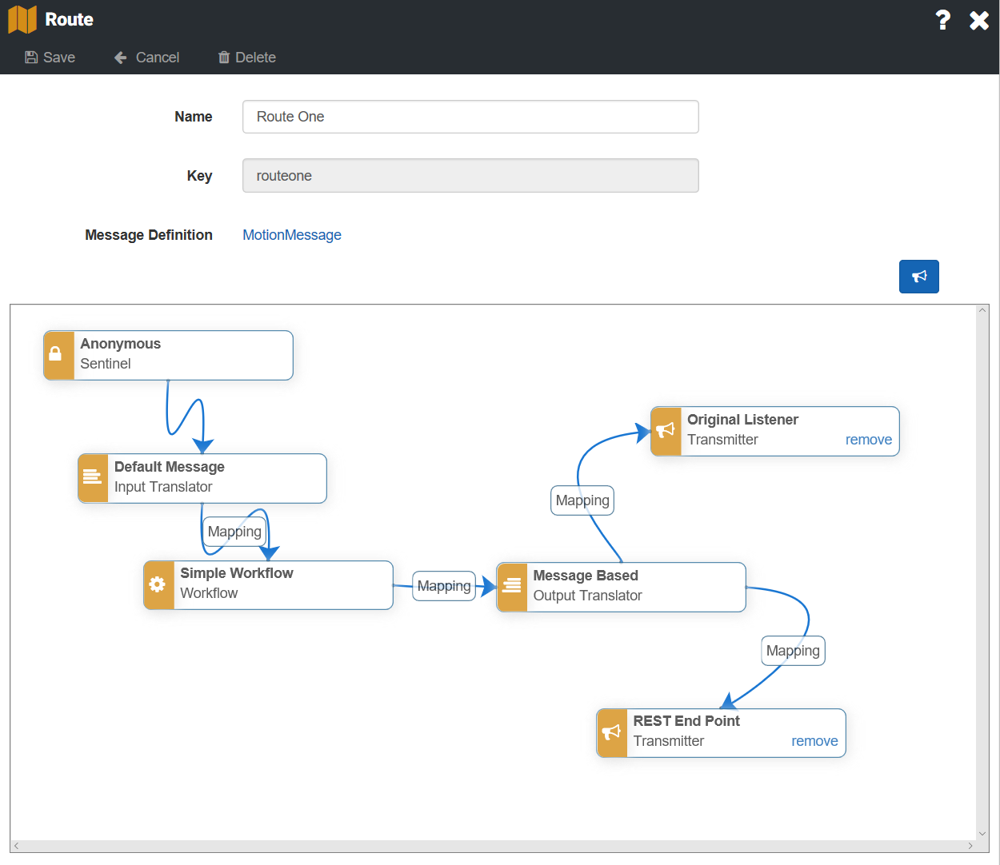

[Home](../Index.md)

# Route

Routes are used to create a path through [Pipeline Execution Modules](../PipelineModules/Index.md) that will be used to process
[Incoming Messages](../Messaging/IncomingMessages.md) from your devices.  

A [Device Configuration](../Devices/DeviceConfigurations.md) can have many routes and each route is associated 
with a [Message ID](../Messaging/Parsing/MessageIdParsing.md).

Here is the basic flow:
1. The [Planner](../PipelineModules/Planner.md) determines the device configuration from the [Device ID](../Messaging/Parsing/DeviceIdParsing.md) and the [Message ID](../Messaging/Parsing/MessageIdParsing.md) from the incoming message. 
1. Based on the type of message and device configuration, the planner looks up the corresponding route.
1. The Planner then creates a set of instructions that reference pipeline modules that will be executed to process the message. 

### Creating a Route
1. Ensure that you have created and configured the [Pipeline Modules](../PipelineModules/Index.md) you will use in the route. 
1. Open a [Device Configuration](../Devices/DeviceConfigurations.md).
1. Click **Add Route** - A default route will be created to allow you to select pipeline modules.
1. Select a [Message Definition](../Messaging/Index.md). Doing so will associate this route with a message as it arrives from the device.
1. Click on a node in the route and select a Pipeline Module.
1. To add a [Transmitter](../PipelineModules/Transmitter.md), click the **Add Transmitter** button above the route canvas.
1. Configure [Mappings](./Mappings/Index.md) between applicable nodes.

This is an example of a typical route:

1. For this route, [Device Security](../Devices/Security.md) is handled by the [Listener](../PipelineModules/Listener.md), so you can use an anonymous [Sentinal Module](../PipelineModules/Sentinel.md).
2. The [Incoming Message](../Messaging/IncomingMessages.md) contains enough information to [Parse Fields](../Messaging/Parsing/Index.md) from the message so we use a default message [Input Translator](../PipelineModules/InputTranslator.md).
3. We execute a [Workflow](../Workflows/Index.md) called Simple Workflow that you have created.
4. The [Output Translator](../PipelineModules/OutputTranslator.md) takes the [Output Commands](../Workflows/OutputCommands.md) from the workflow and converts them into an [Outgoing Message](../Messaging/OutgoingMessages.md) that can be either sent back to the device or a third-party endpoint with a [Transmitter](../PipelineModules/Transmitter.md).
5. The [Transmitter Modules](../PipelineModules/Transmitter.md) take those [Outgoing Messages](../Messaging/OutgoingMessages.md) and either send them back to the device via the original listener, or forward them to a third-party endpoint.

### Mappings
To allow for maximum reusability, some pipeline modules require [Mappings](./Mappings/Index.md).
* **Input Translator to Workflow Inputs** - [Map](./Mappings/OutputTranslatorToTransmitter.md) the [Fields](../Messaging/MessageFields.md) from [Messages](../Messaging/IncomingMessages.md) that were [Parsed](../Messaging/Parsing/Index.md) with the [Input Translator](../PipelineModules/InputTranslator.md) to [Inputs](../Workflows/Input.md) on the [Workflow Module](../PipelineModules/Workflow.md) that will process the message.
* **Workflow Output Commands to Output Translator** - [Map](./Mappings/OutputTranslatorToTransmitter.md) the [Outputs](../Workflows/OutputCommands.md) created by the [Device Workflow](../Workflows/index.md) to [Messages](../Messaging/OutgoingMessages.md) that will be created by the [Output Translator](../PipelineModules/OutputTranslator.md).
* **Output Translator to Transmitter** - [Map](./Mappings/OutputTranslatorToTransmitter.md) the messages you created with the [Output Translator](../PipelineModules/OutputTranslator.md) to the [Transmitter](../PipelineModules/Transmitter.md) that will send them.
