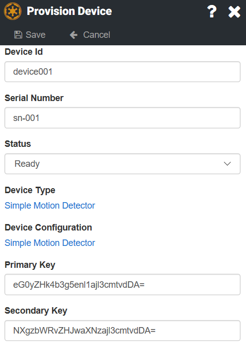

# Security Fields

Once you have identified your device by locating its [Device ID](../Messaging/Parsing/DeviceIdParsing.md), you 
need to [Locate the Security Field](LocatingSecurityField.md).

The Security Field is a piece of the message that contains information that only the device would know or 
it is a specified value that could be constructed with information that only that device can access.

It is important to protect your Access Keys.  If they become compromised, a malicious device or piece of software could impersonate your device. 

When you create your devices, you have two Access Keys associated with them, the primary and secondary keys. We provide
two keys so that you are able to update them without any downtime.  Either key can be used to authenticate your device.



Every time you add a device, these keys will be generated for you.  However, you can modify them to be anything you want.

The initial keys are generated and stored as a Base64 encoded value using the following algorithm within the browser
or Device Manager:
```
btoa(Math.random().toString(36).substring(2) + (new Date()).getTime().toString(36))
```

Although the initial Access Keys are Base64 encoded, you can replace them with simple strings.  However, you will not be able to use those 
simple strings with [SAS Authentication](SAS.md).

Once the primary and secondary keys have been created, they can be used in one of two ways to authenticate your devices:
* [Access Key](AccessKey.md) - The value in the primary or secondary key is sent in plain text somewhere in your message.  This approach is only recommended if your messages are encrypted with [Transport Layer Security](https://en.wikipedia.org/wiki/Transport_Layer_Security) (TLS).  
* [Basic Access Authentication](BasicAuth.md) - The value in the primary or secondary key is sent in plain text somewhere in your message.  This is only recommended if your messages are encrypted with [Transport Layer Security](https://en.wikipedia.org/wiki/Transport_Layer_Security) (TLS).   
* [Shared Access Signatures](SAS.md) - A token is created and signed at the device level.  That signature is then recreated on the server and the results are compared. If they match, you know that only a device with that key could have created the signed token.
 
If you require a different type of security field, please [Contact Us](https://support.nuviot.com/contactus?source=securityfields) to discuss your needs.
